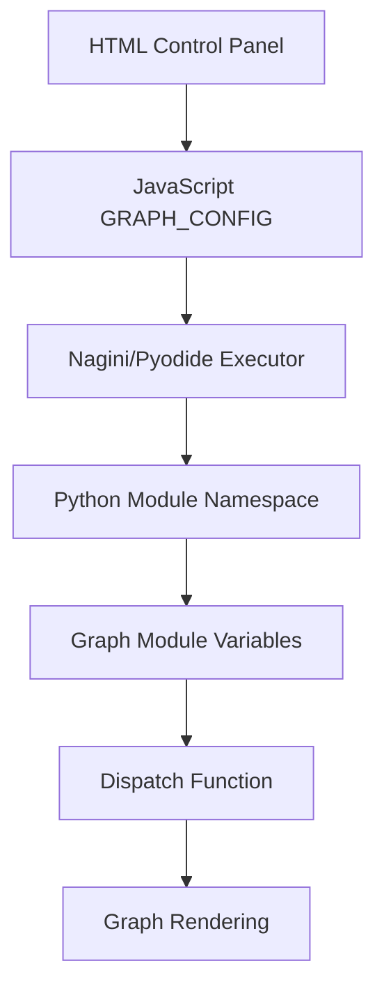

# SUJETS0 Graph System - Dispatch Architecture Documentation

## Overview

This document explains how the SUJETS0 graph system dispatches code from JavaScript to Python graph modules, enabling dynamic mathematical visualizations with configurable parameters.

## Architecture Components

### 1. JavaScript Entry Points

#### **sujets0-app-simple.js** (Interactive Version)
- **Purpose**: Provides an interactive UI with control panel for adjusting graph parameters
- **Key Features**:
  - Dynamic parameter injection into Python modules
  - Real-time graph updates via slider controls
  - Direct file loading without adapter pattern

#### **sujets0-app.js** (Static Version)
- **Purpose**: Renders all graphs with fixed default values
- **Key Features**:
  - Uses Nagini adapter pattern for cleaner imports
  - No interactive controls
  - More robust module loading with dependency ordering

### 2. HTML Interfaces

- **sujets0-simple.html**: Interactive version with control panel
- **sujets0.html**: Static version for display only

## Dispatch Flow

### Step 1: JavaScript Initialization

```javascript
// Configuration object in sujets0-app-simple.js
const GRAPH_CONFIG = {
  Y_LABEL_FOR_HORIZONTAL_LINE: 10,  // Q7 parameter
  A_FLOAT_FOR_AFFINE_LINE: 0.75,    // Q8 slope
  B_FLOAT_FOR_AFFINE_LINE: 2.0,     // Q8 y-intercept
  A_SHIFT_MAGNITUDE: 5,              // Q10 vertical shift magnitude
};
```

### Step 2: Loading Python Modules via Nagini/Pyodide

The JavaScript loads Python files and injects configuration variables:

```javascript
// In loadGraphFile() function
module.__dict__['A_SHIFT_MAGNITUDE'] = ${aShiftMagnitude}
```

### Step 3: Python Module Reception

Each parabola graph module receives the injected variables:

```python
# In spe_sujet1_auto_10_question_small_parabola_a_s1_a_m.py
try:
    A_SHIFT_MAGNITUDE = globals()["A_SHIFT_MAGNITUDE"]
    print(f"✅ Using injected A_SHIFT_MAGNITUDE = {A_SHIFT_MAGNITUDE}")
except KeyError:
    A_SHIFT_MAGNITUDE = 5  # Default value
    print(f"⚠️ Using default A_SHIFT_MAGNITUDE = {A_SHIFT_MAGNITUDE}")
```

### Step 4: Graph ID-Based Dispatch

The dispatch system uses a clean graph ID lookup:

```python
# In spe_sujet1_auto_10_question_small_dispatch.py
GRAPH_CONFIGS = {
    "s1_a_0": {...},   # y = x²
    "s1_a_m": {...},   # y = x² - 5
    "s1_a_p": {...},   # y = x² + 5
    "sm1_a_0": {...},  # y = -x²
    "sm1_a_m": {...},  # y = -x² - 5
    "sm1_a_p": {...},  # y = -x² + 10
}
```

### Step 5: Graph Generation

Each graph file calls the dispatcher with its specific ID:

```python
# Example from parabola file
def get_graph_dict():
    return generate_parabola_graph(
        "s1_a_m",              # Graph ID for config lookup
        PARABOLA_SIGN,         # +1 or -1
        A_SHIFT_FOR_CASE,      # Fixed curve position
        "filename.py",         # Title
        A_SHIFT_FOR_LABEL,     # Dynamic label value
        A_ADJUST,              # Fine-tuning
    )
```

## Key Design Principles

### 1. **Separation of Concerns**
- **Curve Position**: Fixed by `A_SHIFT_FOR_CASE` (doesn't change with slider)
- **Label Display**: Dynamic via `A_SHIFT_FOR_LABEL` (updates with slider)
- **Visual Layout**: Determined by graph ID lookup in `GRAPH_CONFIGS`

### 2. **Graph ID Convention**
```
Format: {parabola_sign}_{shift_type}
- s1: Sign = +1 (upward parabola, y = x²)
- sm1: Sign = -1 (downward parabola, y = -x²)
- a_0: No shift (a = 0)
- a_m: Negative shift (a = -magnitude)
- a_p: Positive shift (a = +magnitude)
```

### 3. **Configuration Injection Flow**



## File Structure and Dependencies

### Core Files
```
scenery/
├── sujets0-simple.html     # Interactive UI
├── sujets0-app-simple.js   # Interactive controller
├── sujets0.html            # Static UI
└── sujets0-app.js          # Static controller

src/pca_graph_viz/tests/graphs/
├── spe_sujet1_auto_10_question_small_dispatch.py  # Central dispatcher
├── spe_sujet1_auto_10_question_small_parabola_a_s1_a_0.py
├── spe_sujet1_auto_10_question_small_parabola_a_s1_a_m.py
├── spe_sujet1_auto_10_question_small_parabola_a_s1_a_p.py
├── spe_sujet1_auto_10_question_small_parabola_a_sm1_a_0.py
├── spe_sujet1_auto_10_question_small_parabola_a_sm1_a_m.py
└── spe_sujet1_auto_10_question_small_parabola_a_sm1_a_p.py
```

### Import Chain
1. Parabola files import from `.spe_sujet1_auto_10_question_small_dispatch`
2. Dispatch provides `generate_parabola_graph()` function
3. Dispatch looks up configuration using graph ID
4. Configuration includes all visual parameters (axes, labels, ranges)

## Variable Flow Example

For a user setting the slider to `A_SHIFT_MAGNITUDE = 7`:

1. **JavaScript**: Updates `GRAPH_CONFIG.A_SHIFT_MAGNITUDE = 7`
2. **Injection**: Value injected into Python module namespace
3. **Python Module** (`s1_a_m`):
   ```python
   A_SHIFT_MAGNITUDE = 7  # From injection
   A_SHIFT_FOR_LABEL = -7  # Negative for "_m" files
   A_SHIFT_FOR_CASE = -5   # Fixed position
   ```
4. **Dispatch**: 
   - Uses `"s1_a_m"` to lookup visual config
   - Draws curve at y = x² - 5 (fixed)
   - Shows label M(0;-7) (dynamic)

## Benefits of This Architecture

1. **Clean Separation**: Graph positioning vs. label display
2. **Easy Maintenance**: Single source of truth for each graph's visual config
3. **Dynamic Updates**: Labels update without moving curves
4. **Type Safety**: Graph IDs prevent configuration mismatches
5. **Extensibility**: Easy to add new graph types with unique IDs

## Common Operations

### Adding a New Graph Configuration

1. Add entry to `GRAPH_CONFIGS` in dispatch file
2. Create new graph file with appropriate graph ID
3. Add module name to JavaScript loader arrays
4. Configure any dynamic parameters

### Debugging Parameter Flow

1. Check JavaScript console for injection logs
2. Look for Python print statements showing received values
3. Verify graph ID matches configuration key
4. Ensure import paths use relative imports (`.module_name`)

## Technical Details

### Pyodide/Nagini Integration

- **Worker Mode**: Runs Python in web worker for non-blocking execution
- **Module Registration**: Files loaded into virtual filesystem at `/home/pyodide/`
- **Namespace Injection**: Variables added to module `__dict__` before execution
- **Result Communication**: Uses `missive()` function to send data back to JavaScript

### SVG Rendering Pipeline

1. Python generates graph dictionary with SVG parameters
2. Dictionary serialized to JSON
3. JavaScript receives via `result.missive`
4. SVG elements created in DOM
5. LaTeX rendered via KaTeX for mathematical notation

## Troubleshooting

### Common Issues

1. **Import Errors**: Ensure relative imports use dot notation
2. **Missing Configurations**: Check graph ID exists in `GRAPH_CONFIGS`
3. **Label Not Updating**: Verify variable injection in JavaScript
4. **Curve Position Wrong**: Check `A_SHIFT_FOR_CASE` value
5. **Module Not Found**: Confirm file loaded in correct order (dispatch before dependent modules)

### Debug Commands

```javascript
// Check loaded configuration
console.log(window.GRAPH_CONFIG);

// Verify module loading
console.log(Object.keys(allGraphs));
```

```python
# Check injected values
print(f"A_SHIFT_MAGNITUDE = {globals().get('A_SHIFT_MAGNITUDE', 'NOT SET')}")
```

## Summary

The SUJETS0 dispatch system elegantly separates:
- **Static graph appearance** (curves, axes, ranges) - determined by graph ID
- **Dynamic label values** - updated via JavaScript injection
- **Module organization** - clean dependency chain with central dispatcher

This architecture enables interactive mathematical visualizations while maintaining clean, maintainable code structure.
